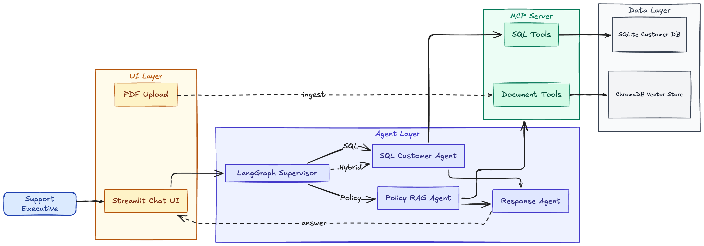

# GenAI Multi-Agent Customer Support Assistant

## Overview

This project is a GenAI multi-agent assistant for customer support workflows. It answers natural language questions using structured customer data from SQLite and policy PDFs through retrieval-augmented generation (RAG).

The assistant can look up customer profiles and ticket history, search indexed policy documents, and combine both sources into a clear support response.

## Objective

The system is designed to:

- Query structured customer-related data using natural language
- Process policy PDFs into a searchable knowledge base
- Generate accurate, context-aware support responses

## Key Features

- SQL Customer Agent for customer profiles and support ticket history
- Policy RAG Agent for uploaded policy PDFs
- LangGraph Supervisor Agent for routing
- Response Synthesis Agent for final answers
- MCP-style tool layer for SQL and document tools
- Streamlit chat UI with PDF upload

## Architecture



The supervisor decides whether a question needs customer data, policy context, both, or a general response. Specialist agents retrieve the relevant context through the tool layer, and the response agent produces the final answer for the support executive.

## Project Setup

Prerequisites:

- Python 3.10+
- OpenAI API key

Set up the environment:

```bash
python -m venv .venv
source .venv/bin/activate
pip install -r requirements.txt
cp .env.example .env
```

On Windows, activate the virtual environment with:

```bash
.venv\Scripts\activate
```

Add your OpenAI API key to `.env`:

```env
OPENAI_API_KEY=your-openai-api-key
```

Create the SQLite demo data and sample policy PDFs:

```bash
python -m src.create_dummy_data
python -m src.create_policy_pdfs
```

Run the Streamlit app:

```bash
streamlit run app.py
```

`data/customers.db` is generated locally and is not committed to the repository. Run `python -m src.create_dummy_data` before asking customer-related questions.

Optional variables such as `OPENAI_MODEL`, `SQLITE_DB_PATH`, `CHROMA_PERSIST_DIR`, and `POLICIES_DIR` can be left at their defaults for the demo.

## Usage

The Streamlit app provides:

- A chat interface for natural language support questions
- A sidebar for uploading and indexing policy PDFs
- An indicator showing which agent handled each response

To use RAG over policies:

1. Start the Streamlit app.
2. Upload a policy PDF from the sidebar, or use the generated demo PDFs from `data/policies/`.
3. Click **Process Policy PDF**.
4. Ask a policy-related question in the chat.

### PDF Indexing Note

Uploading and processing a PDF from the Streamlit sidebar resets the existing ChromaDB vector index. For the demo, use one complete policy PDF or process the desired PDF before asking related policy questions.

## MCP Server / Tool Layer

The project includes an MCP-style tool layer in `src/mcp_server/server.py`. For the Streamlit demo, agents call the local tool registry directly through `call_tool()`, so a separate MCP process is not required.

The tool layer keeps SQL customer lookups and document retrieval behind predefined interfaces. SQL tools query the local SQLite customer database, while document tools ingest PDFs, store embeddings in ChromaDB, and retrieve policy context for RAG answers.

The optional FastMCP server can be started with:

```bash
python -m src.mcp_server.server
```

This exposes the same predefined SQL and document tools through an MCP-compatible interface.

## Example Questions

- Give me a quick overview of customer Ema Johnson's profile and past support ticket details.
- Show me Daniel Smith's open support tickets.
- Show me Priya Patel's refund-related tickets.
- What is the current refund policy?
- What does the warranty policy say?
- Can Ema Johnson get a refund based on her support history and the refund policy?

## Demo Video

Demo video: https://youtu.be/Z3qu_uJPXF0

## Main Components

- `app.py` - Streamlit UI
- `src/graph/workflow.py` - LangGraph workflow and routing
- `src/agents/supervisor.py` - Supervisor routing agent
- `src/agents/sql_agent.py` - Customer data agent
- `src/agents/rag_agent.py` - Policy RAG agent
- `src/agents/response_agent.py` - Final response agent
- `src/mcp_server/server.py` - MCP-style tool registry and optional FastMCP server
- `src/tools/sql_tools.py` - SQLite lookup tools
- `src/tools/document_tools.py` - PDF ingestion and policy search tools
- `src/rag/` - PDF loading, vector storage, retrieval, and RAG logic

## Generated Local Files

- `data/customers.db` is generated by `python -m src.create_dummy_data` and is not committed.
- `chroma_db/` is generated locally for the ChromaDB vector index and is not committed.
- Synthetic demo policy PDFs can be generated with `python -m src.create_policy_pdfs`.

## Running Tests

```bash
python -m pytest
```

## Notes

- Customer data is synthetic and stored in SQLite.
- Policy PDFs can be public/sample or synthetic demo PDFs.
- SQL access uses predefined, parameterized tools instead of LLM-generated raw SQL.
- RAG answers are generated from retrieved policy document context.
- Mixed questions combine SQL customer data and policy document context.
- Generated files such as `data/customers.db` and ChromaDB indexes are created locally and should not be committed.
